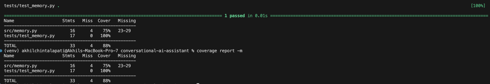

# Jokester Bot (Claude 3.5 Haiku via Amazon Bedrock)

Jokester Bot is a full-stack, witty, and over-the-top chatbot that answers any question - math, facts, advice, or jokes- in a needlessly complicated, step-by-step, and hilarious way (but always gives the correct answer). Powered by Amazon Bedrock using the Anthropic Claude 3.5 Haiku model and a modern React frontend with a dark theme.

---

## Model & Architecture

- **Model:** `anthropic.claude-3-5-haiku-20241022-v1:0` (Claude 3.5 Haiku, via Amazon Bedrock)
- **Backend:** Python (Flask), integrates with Bedrock for LLM calls
- **Frontend:** React with Bootstrap (dark theme)
- **Memory:** Keeps recent conversation turns for context
- **Prompting:** Uses a few-shot prompt to instruct the model to answer in a witty, complicated, and funny way

---

## How It Works

1. **User sends a message** in the frontend chat (any question, joke, or request).
2. **Frontend** sends the message to the backend API (`/api/chat`).
3. **Backend**:
   - Checks for harmful or abusive content using the LLM.
   - Builds a conversation history as a list of messages.
   - Injects a witty, few-shot prompt (with examples) into the first user message.
   - Calls the Claude 3.5 Haiku model via Amazon Bedrock with the chat history.
   - Receives a witty, step-by-step, and correct answer from the model.
   - Updates memory and returns the answer to the frontend.
4. **Frontend** displays the answer in a fun, dark-themed chat interface.

---

## Features

- Answers all questions with wit, humor, and a bit of drama
- Always provides the correct answer, but in a fun, roundabout way
- Keeps conversations positive and safe
- Remembers recent conversation context
- Modern React frontend with a dark Bootstrap theme
- REST API backend using Flask

## Project Structure

```
conversational-ai-assistant/
├── src/                # Python backend (Bedrock, memory, API server)
├── tests/              # Pytest unit tests
├── frontend/           # React frontend (Bootstrap chat UI, dark theme)
├── requirements.txt    # Python dependencies
├── .env                # AWS credentials (not committed)
└── README.md           # This file
```

---

## Setup Guide

### 1. Backend Setup

1. Create and activate a Python virtual environment:

   ```bash
   python3 -m venv venv
   source venv/bin/activate
   ```
2. Install dependencies:

   ```bash
   pip install -r requirements.txt
   ```
3. Set up your `.env` file with AWS credentials and region:

   ```ini
   AWS_ACCESS_KEY_ID=your_access_key
   AWS_SECRET_ACCESS_KEY=your_secret_key
   AWS_REGION=us-east-1
   ```
4. Run the backend API server:

   ```bash
   python src/api_server.py
   ```

   The backend exposes a POST endpoint at `/api/chat` that accepts `{ "message": "..." }` and returns `{ "reply": "..." }`.

---

### 2. Frontend Setup

1. Go to the `frontend` directory:

   ```bash
   cd frontend
   ```
2. Install dependencies:

   ```bash
   npm install
   ```
3. Start the React app:

   ```bash
   npm start
   ```

   The app will open at `http://localhost:3000`.

---

## How to Use

- Type any question or ask for a joke in the chat box.
- Jokester Bot will answer in a complicated, witty, and funny way (but always correct!).
- Type 'fact' for a fun fact.
- The bot will gently nudge you to keep things positive if you try to be mean.

---

## Example Usage

```
You: What's 2 + 2?
Jokester Bot: Ah, the age-old question! First, gather two apples. Then, gather two more apples. Now, resist the urge to eat them. Place them together. Count: one, two, three, four! After this epic fruit assembly, the answer is... 4!

You: Who wrote Hamlet?
Jokester Bot: Picture a man with a quill, a ruffled collar, and a flair for drama. He invents words, ponders existence, and rocks a mean goatee. After much ado, the answer is: William Shakespeare!
```

---

## What Was Implemented

- Python backend with Bedrock Claude integration, memory, and error handling
- REST API for chat
- React frontend with a dark Bootstrap chat interface
- Witty, complicated, and funny answer style (few-shot prompt)
- Environment variable and credential management
- Unit tests for memory/context
- Full documentation and setup instructions

---

## Testing & Coverage

- To run all tests:
  ```bash
  pytest
  ```
- To check code coverage:
  ```bash
  coverage run -m pytest
  coverage report -m
  ```
- Example test: `tests/test_memory.py` checks the memory/context logic.

Here are the TEST results:



---

## License

[MIT License](LICENSE)
