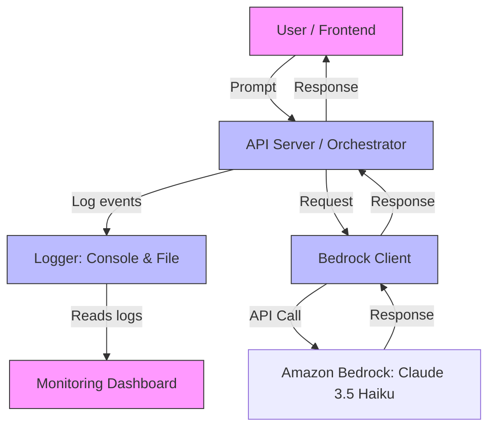

# Orchestrated Bedrock Pipeline

## Overview

This project demonstrates an orchestrated workflow for interacting with Amazon Bedrock (Claude 3.5 Haiku) using a robust, production-ready Python pipeline. It features:

- Modular orchestration
- Monitoring and logging
- Retry mechanisms for reliability
- Testable, extensible design

## Architecture

- **orchestrator.py**: Main workflow entrypoint. Handles retries, logging, and error propagation.
- **bedrock_client.py**: Handles all communication with Amazon Bedrock (Claude 3.5 Haiku).
- **logger.py**: Provides rich, timestamped logging for monitoring and debugging.
- **tests/**: Unit and integration tests for pipeline reliability.

## Architecture Diagram



This diagram shows the flow from user input through the orchestrator, logging, Bedrock API, and monitoring dashboard.Orchestrated Workflow

1. **Input**: User provides a prompt (e.g., "Tell me a joke").
2. **Logging**: All steps are logged with timestamps and color-coded status (info, success, error).
3. **Retry Mechanism**: If Claude invocation fails (network, API, or model error), the pipeline retries up to 3 times with a delay between attempts.
4. **Claude Invocation**: The prompt is sent to Bedrock as a chat message. The response is logged and returned.
5. **Error Handling**: If all retries fail, the error is logged and raised for upstream handling.

## Monitoring & Logging

- Uses the `rich` library for colored, timestamped logs.
- Logs every prompt, response, error, and retry attempt.
- Example log output:
  ```
  [INFO 2025-06-21 16:02:20.584230] Received prompt: hi
  [ERROR 2025-06-21 16:02:23.474639] Claude invocation failed: ...
  [INFO 2025-06-21 16:02:25.633015] Retrying in 2 seconds...
  [SUCCESS 2025-06-21 16:02:27.821479] Claude responded successfully
  [INFO 2025-06-21 16:02:27.821479] Response: ...
  ```

## Retry Mechanism

- Configurable via the `@retry_on_failure` decorator in `orchestrator.py`.
- Default: 3 attempts, 2 seconds between retries.
- All failures and retries are logged.

## Usage

1. Activate your virtual environment and install requirements:

   ```bash
   pip install -r requirements.txt
   ```
2. Set up your `.env` file with AWS credentials and region.
3. Run the pipeline:

   ```bash
   python run_pipeline.py
   ```

   You will be prompted for input, and the orchestrated workflow will handle the rest.

## What We Are Testing

- **Pipeline Orchestration:** Ensures the workflow from user prompt to Claude response works as expected.
- **Retry Logic:** Verifies that failed Claude invocations are retried and errors are handled gracefully.
- **Logging:** Confirms that all steps, errors, and retries are logged with correct formatting.
- **Mocked Tests:** Use mocks to simulate Claude responses for fast, reliable unit testing.
- **Integration Test:** Optionally runs a real end-to-end test against Claude 3.5 Haiku (requires valid AWS credentials and Bedrock access).

### Test Files

- `tests/test_pipeline.py`: Contains all unit and integration tests for the pipeline.

### How to Run Tests

1. **Run all tests:**

   ```bash
   pytest
   ```
2. **Check code coverage:**

   ```bash
   coverage run -m pytest
   coverage report -m
   ```
3. **Test details:**

   - **Mocked tests** (safe for CI): Test pipeline success, empty responses, and error handling using mocked Claude responses.
   - **Integration test**: Sends a real prompt to Claude via Bedrock and checks the response (ensure AWS credentials are set).

<style>#mermaid-1750549966777{font-family:sans-serif;font-size:16px;fill:#333;}#mermaid-1750549966777 .error-icon{fill:#552222;}#mermaid-1750549966777 .error-text{fill:#552222;stroke:#552222;}#mermaid-1750549966777 .edge-thickness-normal{stroke-width:2px;}#mermaid-1750549966777 .edge-thickness-thick{stroke-width:3.5px;}#mermaid-1750549966777 .edge-pattern-solid{stroke-dasharray:0;}#mermaid-1750549966777 .edge-pattern-dashed{stroke-dasharray:3;}#mermaid-1750549966777 .edge-pattern-dotted{stroke-dasharray:2;}#mermaid-1750549966777 .marker{fill:#333333;}#mermaid-1750549966777 .marker.cross{stroke:#333333;}#mermaid-1750549966777 svg{font-family:sans-serif;font-size:16px;}#mermaid-1750549966777 .label{font-family:sans-serif;color:#333;}#mermaid-1750549966777 .label text{fill:#333;}#mermaid-1750549966777 .node rect,#mermaid-1750549966777 .node circle,#mermaid-1750549966777 .node ellipse,#mermaid-1750549966777 .node polygon,#mermaid-1750549966777 .node path{fill:#ECECFF;stroke:#9370DB;stroke-width:1px;}#mermaid-1750549966777 .node .label{text-align:center;}#mermaid-1750549966777 .node.clickable{cursor:pointer;}#mermaid-1750549966777 .arrowheadPath{fill:#333333;}#mermaid-1750549966777 .edgePath .path{stroke:#333333;stroke-width:1.5px;}#mermaid-1750549966777 .flowchart-link{stroke:#333333;fill:none;}#mermaid-1750549966777 .edgeLabel{background-color:#e8e8e8;text-align:center;}#mermaid-1750549966777 .edgeLabel rect{opacity:0.5;background-color:#e8e8e8;fill:#e8e8e8;}#mermaid-1750549966777 .cluster rect{fill:#ffffde;stroke:#aaaa33;stroke-width:1px;}#mermaid-1750549966777 .cluster text{fill:#333;}#mermaid-1750549966777 div.mermaidTooltip{position:absolute;text-align:center;max-width:200px;padding:2px;font-family:sans-serif;font-size:12px;background:hsl(80,100%,96.2745098039%);border:1px solid #aaaa33;border-radius:2px;pointer-events:none;z-index:100;}#mermaid-1750549966777:root{--mermaid-font-family:sans-serif;}#mermaid-1750549966777:root{--mermaid-alt-font-family:sans-serif;}#mermaid-1750549966777 flowchart{fill:apa;}</style>
