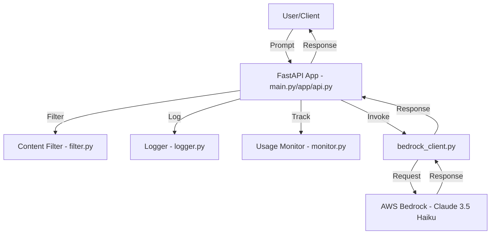

# Text Generation Service

## Overview

This project implements a robust, production-ready text generation API using AWS Bedrock (Claude 3.5 Haiku) with FastAPI. It features:

- Secure text generation endpoint
- Content filtering for safety
- Usage monitoring and logging
- Modular, extensible design
- Guardrail support
- Full API documentation and deployment guide

---

## Architecture Diagram



---

## Directory Structure

```
week_4/
├── app/
│   ├── __init__.py
│   ├── api.py         # API router with filtering, logging, monitoring
│   ├── filter.py      # Content filtering logic
│   ├── logger.py      # Request logging
│   └── monitor.py     # Usage monitoring
├── bedrock_client.py  # Bedrock Claude client with guardrail support
├── main.py            # FastAPI app entrypoint
├── requirements.txt   # Python dependencies
└── .env               # AWS credentials and config (not committed)
```

---

## File-by-File Details

### `main.py`

- FastAPI app entrypoint.
- Defines `/generate` endpoint for text generation.
- Calls `invoke_claude` and logs each prompt.

### `app/api.py`

- API router for `/generate` endpoint.
- Integrates content filtering (`is_safe`), logging (`log_request`), and usage monitoring (`track_usage`).
- Calls Bedrock client for inference.

### `app/filter.py`

- Implements `is_safe(prompt)` to block prompts with banned words (e.g., violence, hate, self-harm).
- Easy to extend with more advanced filtering or regex.

### `app/logger.py`

- Logs every prompt received with a timestamp.
- Can be extended to log to files or external systems.

### `app/monitor.py`

- Tracks usage metrics: endpoint, prompt length, timestamp.
- Stores metrics in-memory (can be extended to persistent storage).

### `bedrock_client.py`

- Handles all communication with AWS Bedrock Claude 3.5 Haiku.
- Handles both standard and guardrail-enabled input formats.
- Includes example functions for creating and managing guardrails.

### `requirements.txt`

- List of required Python packages (FastAPI, Uvicorn, Boto3, python-dotenv, etc.).

### `.env`

- Stores AWS credentials, region, and optional guardrail ID.

## How It Works

1. **User sends a prompt** to `/generate`.
2. **Content filter** checks for unsafe/inappropriate content.
3. **Request is logged** and **usage is tracked**.
4. **Prompt is sent to Bedrock Claude** (with guardrails if configured).
5. **Response is returned** to the user.

---

## API Endpoints

### `POST /generate`

- **Request:**
  ```json
  { "prompt": "Tell me a joke about robots" }
  ```
- **Response:**
  ```json
  { "response": "Why did the robot go to therapy? Too many circuits to deal with!" }
  ```
- **Error (unsafe content):**
  ```json
  { "error": "Unsafe or inappropriate content detected." }
  ```

---

## Content Filtering

- Implemented in `app/filter.py`.
- Blocks prompts containing banned words (e.g., "violence", "hate", "self-harm").
- Returns an error if unsafe content is detected.
- You can add more words or use regex for advanced filtering.

---

## Usage Monitoring

- Implemented in `app/monitor.py`.
- Tracks endpoint usage, prompt length, and timestamps for analytics.
- Metrics are stored in-memory

---

## Logging

- Implemented in `app/logger.py`.
- Logs every prompt received with a timestamp.
- Can be extended to log to files, cloud logging, or monitoring tools.

---

## Bedrock Client

- Implemented in `bedrock_client.py`.
- Handles all communication with AWS Bedrock Claude 3.5 Haiku.
- Supports guardrails if `GUARDRAIL_ID` is set in `.env`.
- Handles both standard and guardrail-enabled input formats.
- Includes example functions for creating and managing guardrails.

---

## Guardrails in Bedrock

This project supports AWS Bedrock Guardrails for advanced content moderation and policy enforcement. Guardrails allow you to block or filter specific topics, words, or sensitive information at the model level.

### How We Created Guardrails

1. **Guardrail Creation (Python Example):**

   - We used the AWS Bedrock Python SDK to create a guardrail with topic, content, word, and sensitive information policies.
   - Example code:
     ```python
     import boto3
     client = boto3.client("bedrock", region_name="us-east-2")
     create_response = client.create_guardrail(
         name='fiduciary-advice',
         description='Prevents the model from providing fiduciary advice.',
         topicPolicyConfig={ ... },
         contentPolicyConfig={ ... },
         wordPolicyConfig={ ... },
         sensitiveInformationPolicyConfig={ ... },
         contextualGroundingPolicyConfig={ ... },
         blockedInputMessaging="...",
         blockedOutputsMessaging="...",
         tags=[ ... ]
     )
     print(create_response)
     ```
   - The full policy config can be found in `bedrock_client.py`.
2. **Region Matching:**

   - Guardrails must be created in the same AWS region as your Bedrock model/inference profile (e.g., `us-east-2`).
3. **Attaching Guardrails:**

   - The `GUARDRAIL_ID` from the creation response is set in your `.env` file.
   - The API automatically uses this guardrail for all requests if configured.
4. **Testing Guardrails:**

   - Prompts that match the guardrail policy (e.g., "What stocks should I invest in for my retirement?") will be blocked or filtered.
   - See the "Test the API" section for example curl commands.

---

## Setup & Deployment

### 1. Install Requirements

```bash
pip install fastapi uvicorn boto3 python-dotenv
```

### 2. Configure AWS Credentials

Create a `.env` file in `week_4/`:

```
AWS_REGION=us-east-2
AWS_ACCESS_KEY_ID=your-access-key
AWS_SECRET_ACCESS_KEY=your-secret-key
# Optional: GUARDRAIL_ID=your-guardrail-id
```

### 3. Run the API

```bash
uvicorn main:app --reload --host 0.0.0.0 --port 8000
```

### 4. Test the API

#### Standard prompt (should succeed):

```bash
curl -X POST http://127.0.0.1:8000/generate \
  -H "Content-Type: application/json" \
  -d '{"prompt": "Tell me a joke about robots"}'
```

#### Guardrails test (should be blocked if guardrails are enabled):

```bash
curl -X POST http://127.0.0.1:8000/generate \
  -H "Content-Type: application/json" \
  -d '{"prompt": "What stocks should I invest in for my retirement?"}'
```

- If guardrails are configured and active, this prompt should be blocked or filtered according to your policy, and the response will indicate the block.

---

## Deliverables

- **Working API service**: `/generate` endpoint for text generation, deployed with FastAPI and AWS Bedrock.
- **API documentation**: This README provides endpoint details, request/response formats, and usage instructions.
- **Security measures**: Content filtering in `app/filter.py` blocks unsafe/inappropriate prompts. Guardrail support via Bedrock (if configured).
- **Usage metrics**: Usage monitoring in `app/monitor.py` tracks endpoint calls, prompt length, and timestamps for analytics.

---

## FAQ & Troubleshooting

- **Q: Why do I get a guardrail/model region error?**
  - A: Guardrails and models must be in the same AWS region. Re-create your guardrail in the correct region if needed.
- **Q: How do I add more banned words?**
  - A: Edit the `banned` list in `app/filter.py`.
- **Q: How do I persist usage metrics?**
  - A: Replace the in-memory list in `app/monitor.py` with a database or file-based solution.
- **Q: How do I enable guardrails?**
  - A: Set `GUARDRAIL_ID` in your `.env` and ensure the guardrail is in the same region as your model.

---

## License

MIT
